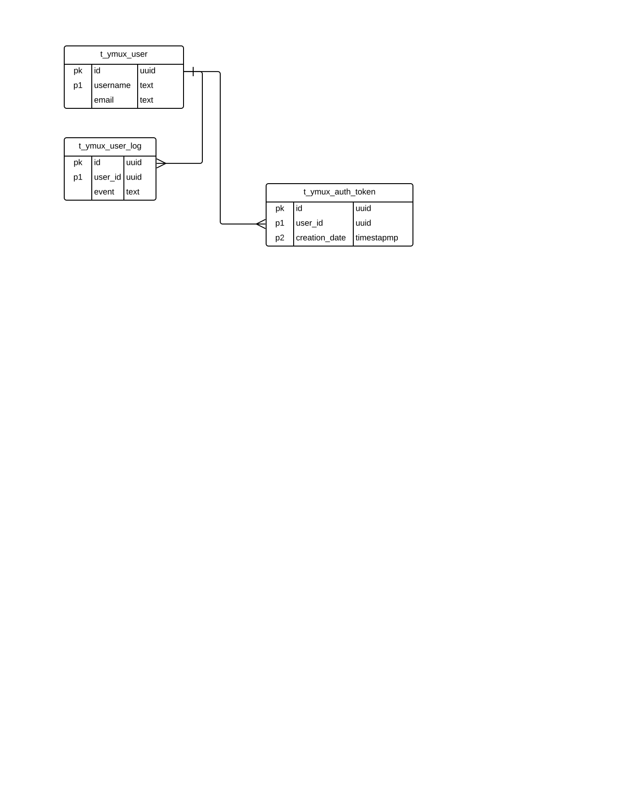

m4_include(../lect-setup.m4)

# Lecture 08 - Design Database with Entity Relationship Diagrams (ERD)

[4820 L08 Draw ERD - https://youtu.be/2gSC6mwCwps](https://youtu.be/2gSC6mwCwps)<br>
[4820 L08 pt2 Use Lucid to draw ERD - https://youtu.be/rBdPFzsqpWI](https://youtu.be/rBdPFzsqpWI)<br>

From Amazon S3 - for download (same as youtube videos)

[4820 L08 Draw ERD](http://uw-s20-2015.s3.amazonaws.com/4820-L08-pt1-ERD-Design.mp4)<br>
[4820 L08 pt2 Use Lucid to draw ERD](http://uw-s20-2015.s3.amazonaws.com/4820-L08-pt2-Draw-ERD-lucid.mp4)<br>


## ERDs.

An example with 3 tables.



An entity is a table.

The lines are foreign keys between tables.

Normally you create a table:

```
CREATE TABLE ct_homework_seen (
	  id						uuid DEFAULT uuid_generate_v4() not null primary key
	, user_id					uuid not null
	, homework_id				uuid not null
	, homework_no				text not null
	, when_seen					timestamp 
	, watch_count				int default 0 not null
	, when_start				timestamp 
 	, updated 					timestamp
 	, created 					timestamp default current_timestamp not null
);
```

It has a unique primary key, type `uuid`, called `id`.

The `user_id` looks like a foreign key to a user table.

```
ALTER TABLE ct_homework_seen
 	ADD CONSTRAINT ct_homework_seen_id_fk
 	FOREIGN KEY (user_id)
 	REFERENCES "t_ymux_user" ("id")
;
```

The foreign key is the line between the tables.

The design above is using [https://lucid.app/](https://lucid.app/)
It is not a tremendous tool for doing a ERD, but there is a free account and it is adequate for small designs.
We will use it in this class.   You should sign up for a free account.


Copyright (C) University of Wyoming, 2021.


