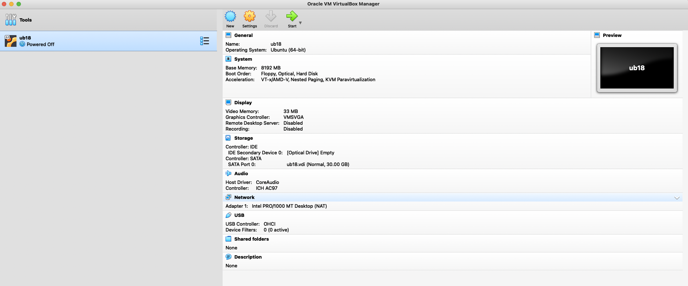
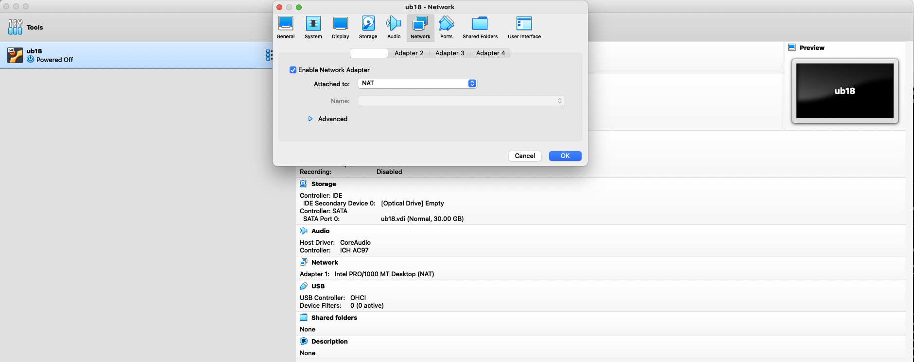
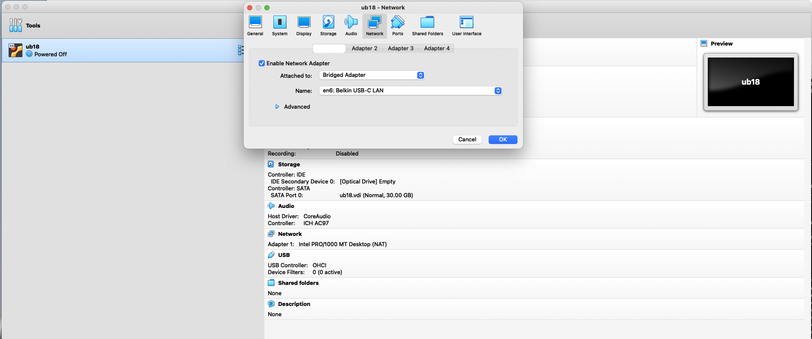

m4_include(../lect-setup.m4)

# How to copy files from system to system

I use a program called 'ssh' for remote login and to copy files.
It is, as far as I can tell, fairly universal with system
administrators.

To Install it on your virtual system:

```
$ sudo apt update
$ sudo apt install openssh-server
```

This creates a process that listens on port 22 for incoming
login requests.  Also this installs a number of tools that
work with 'ssh'.

In your virtual box configuration change the network setup
from Network Address Translated (NAT) to Bridged Networking.
This is on the host by accessing the virtual box console.



and 



Change the NAT to Bridged Network in the modal box.



No back on your client system in Linux let's find out the
IP address of your client.

```
$ ip addr
```

This is the new way to find out the IP address of your 
system.  The old way (requires install of net-tools)

```
$ sudo apt install net-tools
$ ifconfig
```

Now on your host (desktop or laptop) you can connect
to your client system with:


```
C:\> ssh pschlump@192.168.0.47
```

or on Mac:

```
$ ssh pschlump@192.168.0.47
```

When you want to logout of Linux at the bash prompt
you can enter a ^D (control-D) this is a Linux
EOF and ends the login session.

You get prompted for a password.

SSH has the ability to copy files.  Let's copy a file from the
host to the client.

```
$ ls >test.1
$ scp test.1 pschlump@192.168.0.47:/tmp
```

This copies the file up to the common /tmp directory.

On the Linux system let's create a file and then copy
it to the host.

```
$ cd
$ pwd
$ vi test.2
```

Now on the host (Windows/Mac)

```
$ scp pschlump@192.168.0.47:/home/pschlump/test.2 .
$ cat test.2
```

## Passwordless Login

SSH can be setup to not use passwords.  This is the "high security" 
login method - instead it uses strong encryption and public/private
keys.

SSH is already a high-security login if you use a strong password.
Lot's of systems (AWS, Azure etc) now just require this higher
level of security that you get with a public/private key pair.
They don't even allow you to use a password at all.

The way this authentication works is

1. ssh or scp contacts the destination system.
2. the destination system sends a random "message" to sign.
3. your system creates a digital signature on the random message.  It signs with the private key.
4. Your system sends back the signature and message.
5. The remote system checks that the message is correct and validates that the signature is
valid using your public key.
6. You are logged in.

This requires that the destination system has a copy of your public key.
To make this system secure you have to keep your private key private.
You don't share or copy your pirate key from your system. (You do make
careful backups of your keys - if you loose them then you won't be
able to login)

So ... First we need to generate a key pair.   SSH comes with a
tool "ssh-keygen" that will do this for us.  On the host.


```
C:\User\pschlump\> ssh-keygen -t ed25519

```

```
$ cd
$ ls -ld .ssh
```

or on a Mac or Linux (if the directory is not already there)

```
$ cd 
$ mkdir -p .ssh
$ chomod 0755  .ssh
$ cd .ssh
$ ssh-keygen -t ed25519
```

If the directory is there then just

```
$ cd .ssh
$ ssh-keygen -t ed25519
```

There are different types of keys - I tend to use `ed25519`.
They are faster at login.  Most people use `rsa`.  So if you see
in the some website  `-t rsa` that is why.

To send the public key to the destination (Linux system)
Fro your host.

```
$ ssh-copy-id pschlumnp@192.168.0.47
```

It will prompt your for a password based login.

Lets try your ssh login again.
You should not get prompted for a password.
From the Windows/Mac system:

```
C:\user\pschlump\> ssh pschlump@192.168.0.47
```

or


```
$ ssh pschlump@192.168.0.47
```

`scp` should also work without requiring a password
at this point.

All of the stuff for Mac works the same on Linux.
I also use a SSH client from my iPhone and iPad.   This turns an iPad pro into a
very good remote terminal for accessing things like AWS.  If any of you have
seen me send email or use stuff when I am remote then this is how I am usually
doing it.


## References

1. [SSH Keygen on Windows https://phoenixnap.com/kb/generate-ssh-key-windows-10](https://phoenixnap.com/kb/generate-ssh-key-windows-10)
1. [SSH Keygen on Mac https://www.siteground.com/kb/how_to_generate_an_ssh_key_pair_in_mac_os/](https://www.siteground.com/kb/how_to_generate_an_ssh_key_pair_in_mac_os/)
1. [Another mac keygen https://www.techrepublic.com/article/how-to-generate-ssh-keys-on-macos-mojave/](https://www.techrepublic.com/article/how-to-generate-ssh-keys-on-macos-mojave/)
1. [Another Keygen Example https://www.ssh.com/ssh/keygen/](https://www.ssh.com/ssh/keygen/)
1. [Setting up passwordless login https://linuxize.com/post/how-to-setup-passwordless-ssh-login/](https://linuxize.com/post/how-to-setup-passwordless-ssh-login/)
