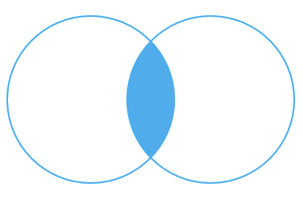

<style>
.pagebreak { page-break-before: always; }
.half { height: 200px; }
</style>


# Interactive - 17 - select with join ( inner join, left outer join )

SQL starts to get fun, and become a programming task as soon
as we have more than one table.

We have already seen a join between name_list and us_state based
on state code.  Let's get specific on how joins work and how
to use them.

The most common join is the "inner" join.   This is when two
tables have a common field and we match that field.

The SQL system takes the first table and creates a loop that
will iterate across the 2nd table and where the field matches
it connects (joins) the data together.

This is all based on sets of data.

Suppose that we have 2 tables, employees and departments.


#### Employee Table


| Name				 | Dept Code |  Pay        |
|--------------------|-----------|-------------|
| Bob                |   1       | $36,000.00  |
| Jane               |   1       | $140,000.00 |
| Sally              |   2       | $121,000.00 |
| Liz                |   2       | $101,000.00 |
| Dave               |   1       | $51,000,00  |
| CEO Kelly          |   3       | $1.00       |
| Uncle Bob          |   NULL    | $96,000.00  |
| Brother Charley    |   NULL    | $48,000.00  |


#### Department

| Department		 | Dept Code |
|--------------------|-----------|
| Sales              |   1       |
| Development        |   2       |
| Executive          |   3       |
| Maintenance        |   4       |

Both tables have `Dept_Code` and by matching them
up we can find that Sally and Liz and the 
Development Department.

File: hw17_1.sql


```

DROP TABLE if exists employee;
DROP TABLE if exists department;

CREATE TABLE employee (
	employee_id serial not null primary key,
	name text not null,
	department_id  int,
	pay numeric(12,2) not null default 0
);

CREATE TABLE department (
	department_id  serial not null primary key,
	dept_name text not null
);

INSERT INTO department ( department_id, dept_name ) values
	( 1, 'Sales' ),
	( 2, 'Development' ),
	( 3, 'Execuatie' ),
	( 4, 'Maintenance' )
;

INSERT INTO employee (  name, department_id, pay ) values	
	( 'Bob', 1, 36000 ),
	( 'Jane', 1, 140000 ),
	( 'Sally', 2, 121000 ),
	( 'Liz', 2, 101000 ),
	( 'Dave', 1, 51000 ),
	( 'CEO Kelly', 3, 1 ),
	( 'Uncle Bob', NULL, 96000 ),
	( 'Brother Charley', NULL, 48000 )
;


```

We have created the table department with a set of used IDs, 1..4.  We need
to update the number generator for the `serial` data to reflect this.
If we don't it will start with 1 and we have already used 1.  We will not
be able to insert data into it.

The command to do this is:

```

ALTER SEQUENCE department_department_id_seq RESTART WITH 5;


```

However you will want to be able to generate this kind of an alter.
The name for the sequence is,  the table name, concatenated with
an underscore, then the column name, then `_seq`.

## Inner Join 

This is the set that both tables have in common.




```
select t1.name as "Employee Name", t2.dept_name as "Department Name", t1.pay "Year pay"
from employee as t1
	join department as t2 on ( t1.department_id = t2.department_id )
;

```

You should get back 6 rows.  Note that "Uncle Bob" fails to show up.
This is an inner join - where the common field is not null.

Note the double quotes `"` around the column names to allow for upper-lower
case aliases on column names.

We can get the database to fill in NULLs for all the values for
`Uncle Bob`.  This is a left outer join.  This is the 2nd most common
join.

## Left Outer Join

This is all the rows in the FROM table joined to the right table
or NULLs where they don't join.


```
select t1.name as "Employee Name", t2.dept_name as "Department Name", t1.pay "Year Pay"
from employee as t1
	left outer join department as t2 on ( t1.department_id = t2.department_id )
;

```

Now you should get back 8 rows including "Uncle Bob".


Now we can answer the question how many people are not in departments and
how much do they get payed.

```
select t1.name as "Employee Name", t2.dept_name as "Department Name", t1.pay "Year Pay"
from employee as t1
	left outer join department as t2 on ( t1.department_id = t2.department_id )
where t1.department_id is null
;

```

or how much pay is spent on employees not in departments.


```
select sum(t0.pay) as "Total Pay"
from (
	select t1.name, t2.dept_name, t1.pay 
	from employee as t1
		left outer join department as t2 on ( t1.department_id = t2.department_id )
	where t1.department_id is null
) t0
;

```

Interesting .... That is $144,000.00 payed out to employees that aren't in
departments.


There are "right" joins but usually I just swap the order of the tables and use the left joins.


